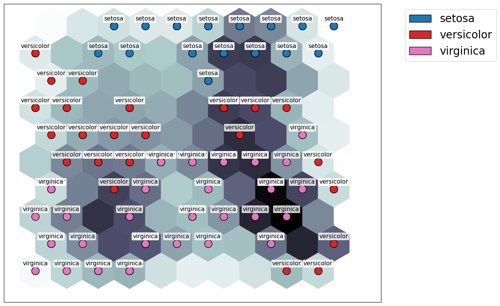

# somkit: A Python Implementation of Self-Organizing Maps (SOMs)

## Overview

`somkit` is a simple implementation of Self-Organizing Maps (SOMs) in Python. This library provides an easy-to-use interface to train and visualize SOMs on various datasets. `somkit` can be used for clustering, data visualization, and dimensionality reduction tasks.

## Usage

To get started, follow these steps:

1. Install

~~~ bash
git clone https://github.com/remokasu/somkit.git
cd somkit
python setup.py install
~~~

2. Train and visualize a SOM with the sample datasets provided:

- For the animal dataset:
~~~ bash
cd examples
python animal.py
~~~

- For the iris dataset:
~~~ bash
cd examples
python iris.py
~~~
