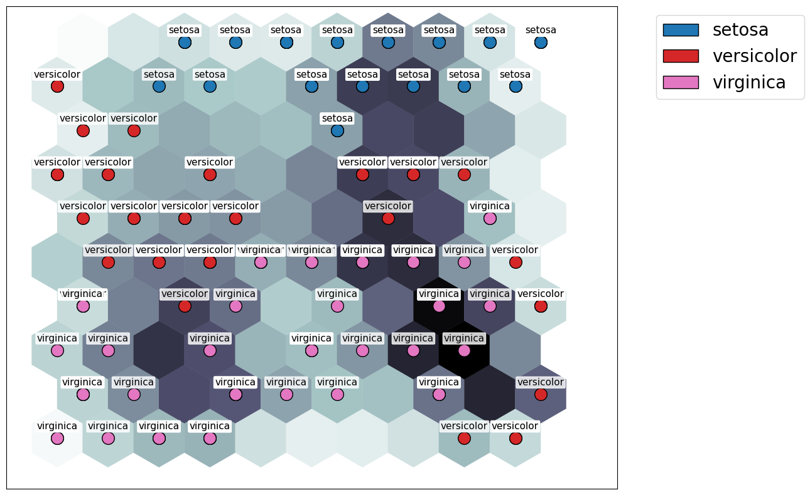

# somkit: A Python Implementation of Self-Organizing Maps (SOMs)


## Overview

`somkit` is a simple implementation of Self-Organizing Maps (SOMs) in Python. This library provides an easy-to-use interface to train and visualize SOMs on various datasets. `somkit` can be used for clustering, data visualization, and dimensionality reduction tasks.

<div style="text-align: center;">

</div>

## Features

- **Multiple topology support**: Hexagonal and Rectangular topologies for Self-Organizing Maps
- **Dynamic learning rate and radius decay** following SOM algorithm standards
- **Multiple visualization methods**:
  - U-Matrix (distance map)
  - Component Planes (feature distribution)
  - Hit Map (data density distribution)
  - Class Distribution Map (class boundaries)
- **Model persistence**: Save and load trained models
- **Comprehensive evaluation metrics**: WCSS, Silhouette Score, Topological Error

## Installation

### From source

```bash
git clone https://github.com/remokasu/somkit.git
cd somkit
pip install -e .
```

## Quick Start

```python
import somkit
from sklearn.datasets import load_iris

# Load dataset
data = load_iris()

# Create and configure SOM
som = somkit.create_trainer(
    data=data,
    size=(10, 10),
    learning_rate=0.01,
    n_func=somkit.functions.gaussian,
    initial_radius=5.0,
    dynamic_radius=True,
    topology="hexagonal",  # or "rectangular"
    random_seed=42
)

# Standardize and initialize
som.standardize_data()
som.initialize_weights_randomly()

# Train the SOM
som.train(n_epochs=500, batch_size=1)

# Evaluate
evaluator = somkit.SOMEvaluator(som)
print("WCSS:", evaluator.calculate_wcss())
print("Silhouette Score:", evaluator.calculate_silhouette_score())

# Visualize
visualizer = somkit.SOMVisualizer(som)
visualizer.plot_umatrix(show_data_points=True)
visualizer.plot_component_planes()
visualizer.plot_hit_map()
visualizer.plot_class_distribution()
```

## Examples

Train and visualize a SOM with the sample datasets provided:

### Animal dataset
```bash
cd examples
python animal.py
```

### Iris dataset
```bash
cd examples
python iris.py
```

## Topology Support

somkit supports both **hexagonal** and **rectangular** topologies:

- **Hexagonal topology** (default): Uses hexagonal grid structure with cube coordinate distance calculation. Provides more uniform neighbor distances and is commonly used in traditional SOM implementations.

- **Rectangular topology**: Uses standard rectangular grid with Euclidean distance. Simpler to visualize and compatible with grid-based data structures.

The topology affects both the **learning process** (distance calculation in neighborhood function) and **visualization** (grid layout and patch shapes).

```python
# Create SOM with rectangular topology
som = somkit.create_trainer(
    data=data,
    size=(10, 10),
    topology="rectangular"
)
```

## Visualization Methods

### U-Matrix
Visualizes the distance between neighboring nodes, revealing cluster boundaries.

### Component Planes
Shows the distribution of each input feature across the SOM, helping understand which features influence different regions.

### Hit Map
Displays the number of data points mapped to each node, revealing data density distribution and potential dead units.

### Class Distribution Map
Shows the distribution of classes at each node with pie charts, making class boundaries visually clear.
