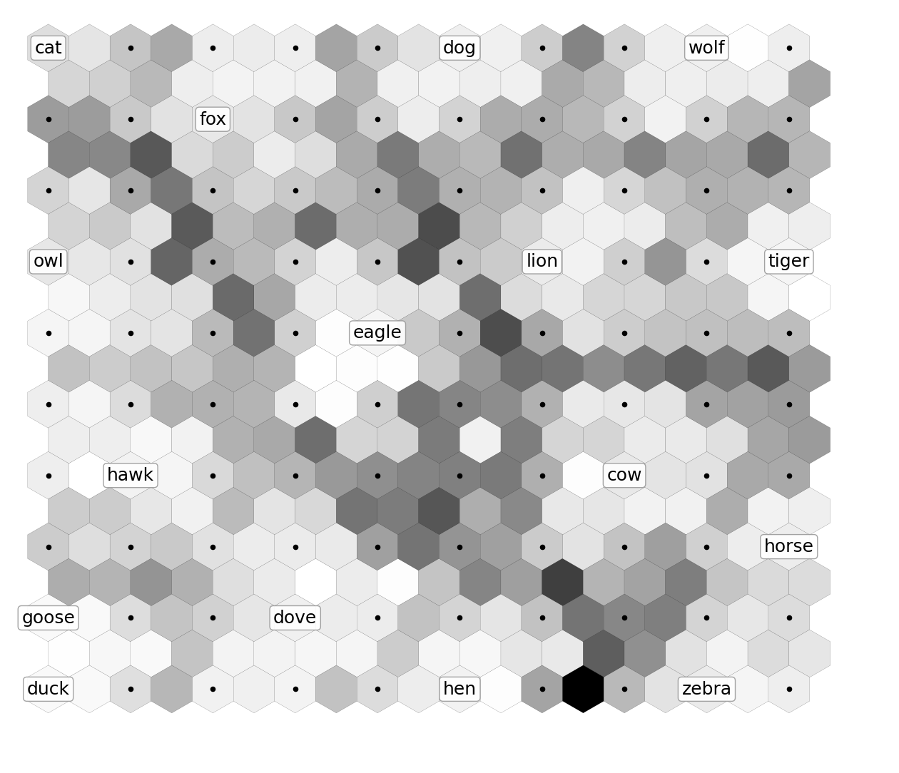
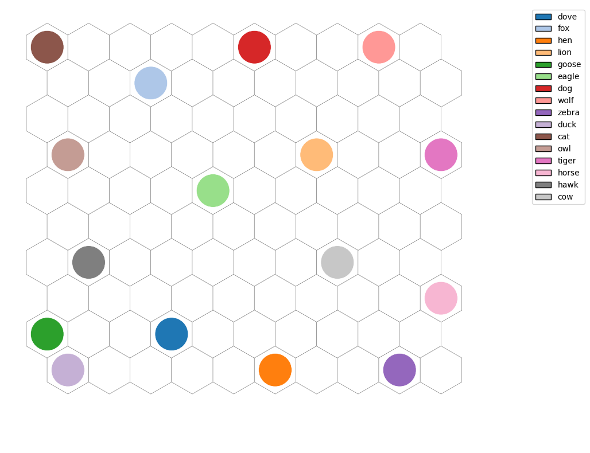
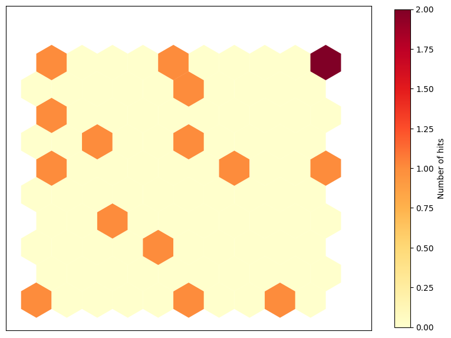
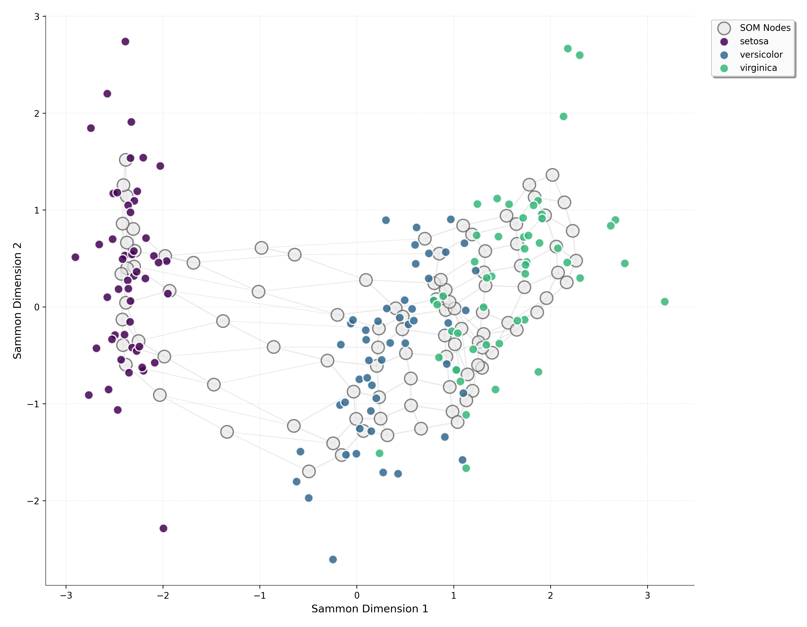

# somkit: A Python Implementation of Self-Organizing Maps (SOMs)


## Overview

`somkit` is a simple implementation of Self-Organizing Maps (SOMs) in Python. This library provides an easy-to-use interface to train and visualize SOMs on various datasets. `somkit` can be used for clustering, data visualization, and dimensionality reduction tasks.

<div align="center">
  <table>
    <tr>
      <td></td>
      <td></td>
    </tr>
    <tr>
      <td></td>
      <td></td>
    </tr>
  </table>
</div>

## Features

- **Multiple topology support**: Hexagonal and Rectangular topologies for Self-Organizing Maps
- **Dynamic learning rate and radius decay** following SOM algorithm standards
- **Multiple visualization methods**:
  - U-Matrix (distance map)
  - Component Planes (feature distribution)
  - Hit Map (data density distribution)
  - Class Distribution Map (class boundaries)
- **Model persistence**: Save and load trained models
- **Comprehensive evaluation metrics**: WCSS, Silhouette Score, Topological Error

## Installation

### From source

```bash
git clone https://github.com/remokasu/somkit.git
cd somkit
pip install -e .
```

## Quick Start

```python
import somkit
from sklearn.datasets import load_iris

# Load dataset
data = load_iris()

# Create and configure SOM
som = somkit.create_trainer(
    data=data,
    size=(10, 10),
    learning_rate=0.01,
    n_func=somkit.functions.gaussian,
    initial_radius=5.0,
    dynamic_radius=True,
    topology="hexagonal",  # or "rectangular"
    random_seed=42
)

# Normalize and initialize
som.normalize_data(method='standard')  # or 'minmax', 'variance'
# som.standardize_data()  # equivalent to normalize_data(method='standard')
som.initialize_weights_linearly()  # or initialize_weights_randomly(), initialize_weights_with_pca()

# Train the SOM
som.train(n_epochs=500, batch_size=1)  # Sequential learning
# or
# som.train_batch(n_epochs=500)  # Batch learning

# Evaluate
evaluator = somkit.SOMEvaluator(som)
print("WCSS:", evaluator.calculate_wcss())
print("Silhouette Score:", evaluator.calculate_silhouette_score())

# Visualize
visualizer = somkit.SOMVisualizer(som)
visualizer.plot_umatrix(show_data_points=True)
visualizer.plot_component_planes()
visualizer.plot_hit_map()
visualizer.plot_class_distribution()
```

## Examples

Train and visualize a SOM with the sample datasets provided:

### Animal dataset
```bash
cd examples
python animal.py
```

### Iris dataset
```bash
cd examples
python iris.py
```

### Batch SOM example
```bash
cd examples
python batch_som_simple.py
```

### Compare Sequential vs Batch SOM
```bash
cd examples
python batch_som_example.py
```

### Normalization methods
```bash
cd examples
python normalization_example.py
```

## Data Normalization

somkit supports multiple normalization methods to scale input features:

```python
# Standard normalization (Z-score): mean=0, std=1
som.normalize_data(method='standard')

# Min-Max normalization: scale to [0, 1]
som.normalize_data(method='minmax')

# Variance normalization: std=1, preserve mean
som.normalize_data(method='variance')

# Backward compatibility
som.standardize_data()  # equivalent to normalize_data(method='standard')
```

Normalization helps prevent features with large ranges from dominating the training process.

## Training Algorithms

somkit supports two training algorithms:

### Sequential Learning (Online Learning)
Updates weights incrementally after each sample or mini-batch.

```python
som.train(n_epochs=500, batch_size=1)  # Sequential learning
```

### Batch Learning
Processes all training samples before updating weights using a weighted average: **w_i(t+1) = Σ_j h_ij(t)·x_j / Σ_j h_ij(t)**

```python
som.train_batch(n_epochs=500)  # Batch learning
```

## Initialization Methods

somkit provides three initialization methods:

### Linear Initialization - **Recommended**
Weight vectors are initialized to lie in a linear subspace spanned by the two largest principal components of the data.

```python
som.initialize_weights_linearly()
```

**Benefits:**
- Faster and more stable convergence
- Better reproducibility
- Improved topology preservation

### PCA Initialization
Initialize using principal component analysis. Similar to linear initialization but uses a different scaling approach.

```python
som.initialize_weights_with_pca()
```

### Random Initialization
Random initialization of weight vectors.

```python
som.initialize_weights_randomly()
```

## Topology Support

somkit supports both **hexagonal** and **rectangular** topologies:

- **Hexagonal topology** (default): Uses hexagonal grid structure with cube coordinate distance calculation. Provides more uniform neighbor distances and is commonly used in traditional SOM implementations.

- **Rectangular topology**: Uses standard rectangular grid with Euclidean distance. Simpler to visualize and compatible with grid-based data structures.

The topology affects both the **learning process** (distance calculation in neighborhood function) and **visualization** (grid layout and patch shapes).

```python
# Create SOM with rectangular topology
som = somkit.create_trainer(
    data=data,
    size=(10, 10),
    topology="rectangular"
)
```

## Visualization Methods

### U-Matrix
Visualizes the distance between neighboring nodes, revealing cluster boundaries.

### Component Planes
Shows the distribution of each input feature across the SOM, helping understand which features influence different regions.

### Hit Map
Displays the number of data points mapped to each node, revealing data density distribution and potential dead units.

### Class Distribution Map
Shows the distribution of classes at each node with pie charts, making class boundaries visually clear.

### Sammon's Mapping Projection
Projects high-dimensional data and SOM nodes to 2D using Sammon's mapping, a non-linear dimensionality reduction technique that preserves inter-point distances. This provides an alternative view of the data structure that is independent of the SOM grid topology.

```python
visualizer = somkit.visualizer.SOMVisualizer(som)

# Visualize both SOM nodes and data points
visualizer.plot_sammon_projection(
    show_nodes=True,
    show_data_points=True,
    show_connections=True,        # Show connections between adjacent nodes
    show_legend=True,
    show_labels=False,            # Show labels on data points
    node_size=200,                # Size of SOM node markers
    data_point_size=100,          # Size of data point markers
    connection_style="spring",    # "spring" or "line"
    colormap="tab10",             # Color scheme for classes
    file_name="sammon_projection.png"
)
```

**Visualization features:**
- **Spring connections**: Connection thickness varies with distance (stronger for closer nodes)
- **Improved styling**: Clean, publication-quality appearance with better color schemes
- **Flexible display**: Control node/data visibility, labels, and sizing
- **High-quality output**: 300 DPI PNG files suitable for papers
